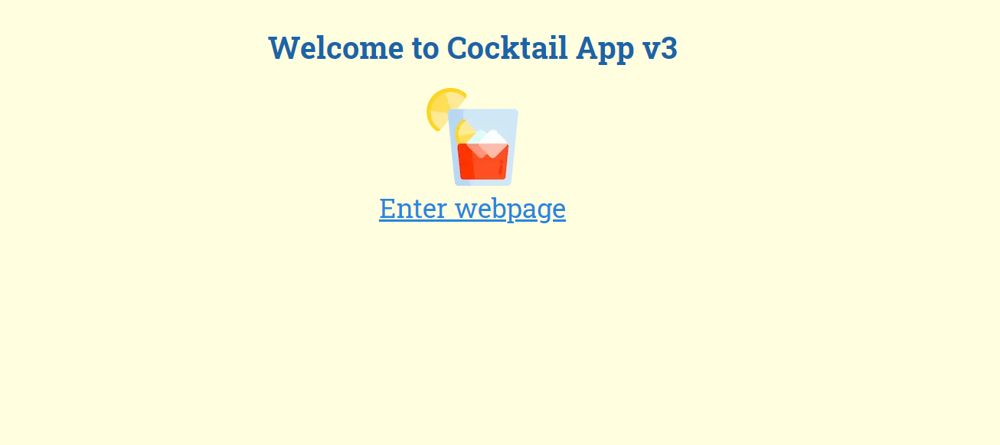
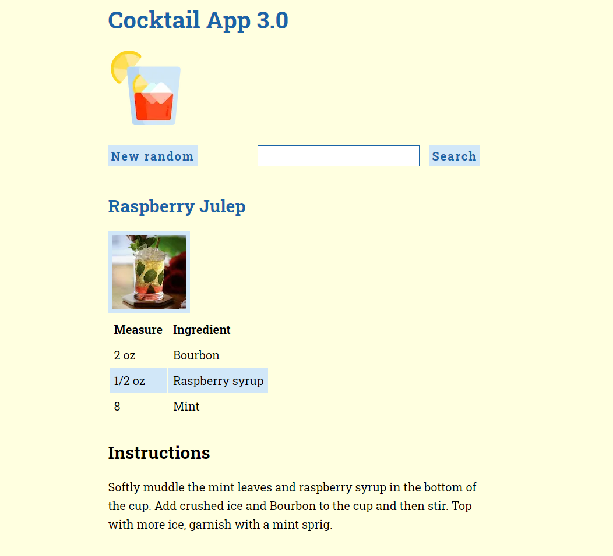

# Cocktail App v3

The project can retrieve information about drinks and cocktails from [TheCocktailDB](https://www.thecocktaildb.com/).

There are two modules in this project:

- get a random cocktail on reload and on clicking
- search for a specific cocktail by name

This is a remake of my earlier [Cocktail App v2](https://github.com/krondorl/cocktail-app-v2).

## New version

Tech specs:
- built with **Next.js**, which is a meta framework for React
- **full stack TypeScript** and TypeScript React code
- API calls are now made with **fetch** instead of axios

## Exercise description

Please see [the project details.](EXERCISE.md)

## System Requirements

* Node.js 16.8 or later
* macOS, Windows or Linux

## Running the app

Please use these commands in order

1. `npm install`
2. `npm run build`
3. `npm run dev`

## Screenshot

The app looks like this.

## License

Please read [the license file.](LICENSE)

## Earlier versions

* [Cocktail App v2](https://github.com/krondorl/cocktail-app-v2)
* [Cocktail App](https://github.com/krondorl/cocktail-app)